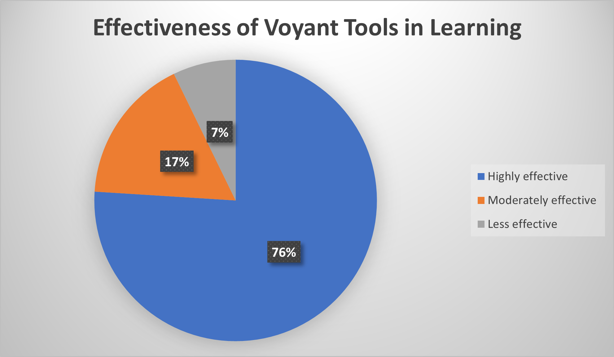

## **Abstract**  
Voyant Tool is a popular web-based analysis platform that offers innovative approaches for analyzing and interpreting texts. The primary objective is to investigate whether digital tools can aid data analysis and interpretation of linguistic information derived from the famous novel, “The Hound of the Baskervilles.” The experiment involved 24 participants, who were equally subdivided into the experimental group and the control group. The study is aligned with two hypotheses. Foremost, the study hypothesizes that Voyant Tools can enhance the analysis and interpretation of humanities texts. Consequently, the second hypothesis is that the tools can strengthen a person’s understanding of humanities knowledge. In brief, Voyant can augment the analysis and interpretation of texts, thereby allowing users to have deeper insights into the underlying concepts, themes, and relationships.

## **Introduction**  
&nbsp;&nbsp;&nbsp;&nbsp;&nbsp;&nbsp;&nbsp;&nbsp;Over the years, rapid technological advancement has strengthened the humanities field by encouraging professionals from different disciplines to integrate digital tools into their practice. Accordingly, the digital humanities field has become an essential consideration in modern art, literature, history, linguistics, and other disciplines aligned with the humanities. Significant research has been performed on the effectiveness of digital tools for visualization and knowledge management in humanities subjects. For example, researchers such as Joe et al. contend that digital learning tools are integral for strengthening data interpretation and decision-making ([862](#3)). Similarly, Drucker emphasizes that digital tools can augment a person’s comprehension of humanities knowledge ([8](#1)). Therefore, this study aims to investigate the effectiveness of digital tools, such as Voyant Tools, in optimizing learning and strengthening an individual’s proficiency in specific humanities subjects.

&nbsp;&nbsp;&nbsp;&nbsp;&nbsp;&nbsp;&nbsp;&nbsp;Digital tools provide users with efficient and accurate mechanisms for analyzing bulky or complex information. Traditionally, the digital humanities discipline was perceived as a text-based discipline; however, recent years have seen the rising popularity of visualization tools for different functions ([369](#4)). Accordingly, the digital humanities discipline has emphasized the importance of cultivating visual literacy to improve the analysis of different types of sources and artifacts. The current study differs from pre-existing investigations because it incorporates digital tools in the analysis of a famous novel titled “The Hound of the Baskervilles.” While most studies rely on secondary sources to investigate the topic, this investigation relies on first-hand information acquired from humanities specialties. Thus, the findings can offer valuable information regarding the impact of digital tools on text analysis and interpretation.

&nbsp;&nbsp;&nbsp;&nbsp;&nbsp;&nbsp;&nbsp;&nbsp;The study aims to investigate the impact of digital tools on text analysis and interpretation. The guiding hypotheses are:  
**Hypothesis 1**: Voyant Tools optimizes text analysis and interpretation of linguistics knowledge within humanities specialists.  
**Hypothesis 2**: Voyant Tools strengthen the visual literacy and comprehension of linguistics knowledge within humanities specialists  

## **Methods**  
### **Participants**  
&nbsp;&nbsp;&nbsp;&nbsp;&nbsp;&nbsp;&nbsp;&nbsp;The sample size consisted of 24 participants with a solid understanding of the humanities discipline. These participants were equally subdivided into the experiment group and the control group. On one hand, the experiment group was instructed to use the Voyant Tools to read and analyze “The Hound of the Baskervilles.” In comparison, the control group was required to read the novel without any digital tools or support. The comparison can elucidate the differences in visual literacy when digital tools are employed for text analysis.  

### **Apparatus and Materials**  
&nbsp;&nbsp;&nbsp;&nbsp;&nbsp;&nbsp;&nbsp;&nbsp;The main materials for this project are the novel “The Hound of Baskervilles” and the Voyant Software. Foremost, “The Hound of Baskervilles” is a captivating novel with rich language and concepts. As a result, it is a suitable source for analyzing linguistic texts. In comparison, Voyant is a renowned tool for assessing diverse concepts, themes, and relationships in textual information. The software’s interface is illustrated below. Before the experiment was undertaken, it was necessary to provide the participants with a brief orientation of the novel and the software to improve their performance when using the apparatus and materials.

>  
**Figure 1**   
_Voyant Tools Interface_  

### **Procedure**  
&nbsp;&nbsp;&nbsp;&nbsp;&nbsp;&nbsp;&nbsp;&nbsp;The experiment was performed systematically to acquire accurate findings. The data collection process involved the use of Voyant Tools to assess the participants’ efficiency when analyzing texts. Fundamentally, the Voyant software usually displays a series of visual images that allow the users to identify important themes and concepts within the text. In addition, one can identify the stylistic techniques and language patterns used in the source. The participants were encouraged to generate appropriate conclusions based on the software’s visual illustrations. Afterward, the participants’ derivations were analyzed using Voyant to determine whether there were common themes between the participants’ findings. This systematic approach allows the researcher to minimize potential bias and errors in the findings.

## **Results**  
&nbsp;&nbsp;&nbsp;&nbsp;&nbsp;&nbsp;&nbsp;&nbsp;The results show that there is a significant relationship between the use of Voyant Tools and visual literacy. Foremost, the Word Frequencies tool can illustrate the most commonly used words within a specific text. In the “Hound of Baskervilles,” the most common words are: sir, said, moor, man, and Holmes, as illustrated below.
 
>  
**Figure 2**  
_Graph of Words Frequencies in Document Segments._  
 
The software also revealed the participants’ perceptions towards the use of Voyant Tools for learning. According to the findings, approximately 76% view the tool as an effective tool for learning, whereas 17% claim it is moderately effective. In comparison, only 7% contend that the software has low effectiveness when used for learning.  

>  
**Figure 3**  
_Participants’ Response on Voyant’s Effectiveness in Learning_  

The findings also show that there are significant differences in comprehension and visual literacy between the control and experiment groups. As shown in Figure 4 below, the experimental group recorded better comprehension and visual literacy performance than the control group. The finding stresses that Voyant Tools can strengthen a user’s understanding of textual information.  

>  
**Figure 4**  
_Comparing comprehension and visual literacy between the control and experimental groups using Voyant Tools._

## **Discussion**  
&nbsp;&nbsp;&nbsp;&nbsp;&nbsp;&nbsp;&nbsp;&nbsp;The findings support the guiding hypothesis. Foremost, the study reveals that Voyant Tools can strengthen visual analysis by improving the identification of keywords and ideas based on the frequency distribution results. The software can highlight the most popular words within a specific segment of a document, thereby allowing users to identify common patterns in the novel’s language and stylistic techniques. The results are supported by existing literature. For example, Haraway explains that digital visualization tools allow a person to look beyond fixed appearances and to find a deeper understanding of ideas, such as metaphors ([589](#2)). As a result, these tools allow one to grasp how language is used in the production of literary constructs and ideas. By perceiving quantitative and textual information as graphical illustrations, digital tools can improve how users visualize and interpret information.  

&nbsp;&nbsp;&nbsp;&nbsp;&nbsp;&nbsp;&nbsp;&nbsp;In addition, the findings demonstrate that Voyant can strengthen a user’s comprehension and visual literacy. The participants highlighted that digital tools are crucial for improving the learning of humanities concepts and ideas. When comparing the experimental and control groups, the findings reveal that the former showed better comprehension rates and visual illustration performance than the latter. Samuels and McGann explain that readers usually interpret information by critically analyzing the dialectical patterns in the information ([47](#5)). This rationale explains why the participants in the experimental group showed better visual literacy and discernment than those in the control group. Thus, digital tools can play an important role in allowing readers to make accurate associations between textual information and their corresponding meanings. 
subjects.  
 

***

 

## Works Cited
 

##### 1 
Drucker, Johanna. “Humanities Approaches to Graphical Display.” *Digital Humanities Quarterly*, vol. 5, no. 1, 2011, pp. 2–51.  
 

##### 2
Haraway, Donna. “Situated Knowledges: The Science Question in Feminism and the Privilege of Partial Perspective.” *Feminist Studies*, vol. 14, no. 3, 1988, pp. 575-599.  
doi.org/10.2307/3178066
 

##### 3
Joo, Soohyung, et al. “Exploring the Digital Humanities Research Agenda: A Text Mining Approach.” *Journal of Documentation*, vol. 78, no. 4, 2021, pp. 853–70,  
doi.org/10.1108/jd-03-2021-0066.  
 

##### 4
Münster, Sander, and Melissa Terras. “The Visual Side of Digital Humanities: A Survey on Topics, Researchers, and Epistemic Cultures.” *Digital Scholarship in the Humanities*, vol. 35, no. 2, 2019, pp. 366–89,  
doi.org/10.1093/llc/fqz022.  
 

##### 5
Samuels, Lisa, and Jerome McGann. “Deformance and Interpretation.” *New Literary History*, vol. 30, no. 1 1999, pp. 25-56.